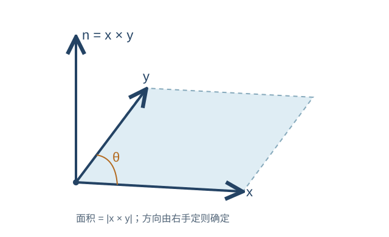
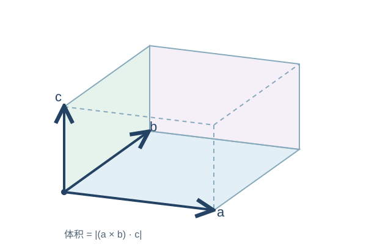

---
tags:
  - 数学基础
  - 线性代数
  - 惯性导航
created: 2026-09-10
---

# 线性代数基础

## 学习说明

首先，非常建议听一听下面这个教程。它对线性代数基础的讲解很清晰，可以帮助我们快速回顾相关知识：

- [# 22分钟掌握向量运算：点积、叉积与三重积](https://www.bilibili.com/video/BV1RNTv63E1U/)

线性代数可以说是整个惯性导航的基石。没有线性代数，我甚至不知道还能用什么工具来描述惯导中的坐标、姿态和运动关系。

矩阵、向量及其基本运算不是本文的重点，因此不再赘述。本文主要整理以下内容：

- 三维向量的叉乘；
- 标量三重积与向量三重积；
- 反对称矩阵及其常用性质；
- 向量与矩阵的求导、积分。

---

## 1. 三维向量的叉乘

### 1.1 几何意义

三维向量的点乘与二维情形基本一致，这里直接略过，重点来看叉乘。

两个三维向量的叉乘仍然是一个三维向量。结果向量的方向同时垂直于原来的两个向量，并遵循右手定则；其模长等于以两个向量为邻边所构成的平行四边形面积。

*图 2.1　向量叉乘与右手定则*

若 $\boldsymbol{n}$ 是符合右手定则的单位法向量，则

$$
\boldsymbol{x}\times\boldsymbol{y}
=
\left(\lVert\boldsymbol{x}\rVert\,\lVert\boldsymbol{y}\rVert\sin\theta\right)\boldsymbol{n}.
$$

### 1.2 坐标形式

设两个三维向量在 $p$ 系中的坐标分别为

$$
\boldsymbol{x}^{p}
=
\begin{bmatrix}
x_1\\
x_2\\
x_3
\end{bmatrix},
\qquad
\boldsymbol{y}^{p}
=
\begin{bmatrix}
y_1\\
y_2\\
y_3
\end{bmatrix}.
$$

则二者的叉乘为

$$
\boldsymbol{x}^{p}\times\boldsymbol{y}^{p}
=
\begin{bmatrix}
x_2y_3-x_3y_2\\
x_3y_1-x_1y_3\\
x_1y_2-x_2y_1
\end{bmatrix}.
$$

将上式写成矩阵形式，有

$$
\begin{aligned}
\boldsymbol{x}^{p}\times\boldsymbol{y}^{p}
&=
\begin{bmatrix}
0 & -x_3 & x_2\\
x_3 & 0 & -x_1\\
-x_2 & x_1 & 0
\end{bmatrix}
\boldsymbol{y}^{p}\\
&\triangleq
\left(\boldsymbol{x}^{p}\times\right)\boldsymbol{y}^{p}\\
&=-\left(\boldsymbol{y}^{p}\times\right)\boldsymbol{x}^{p}\\
&=-\boldsymbol{y}^{p}\times\boldsymbol{x}^{p}.
\end{aligned}
$$

其中，$\left(\boldsymbol{x}^{p}\times\right)$ 称为向量坐标 $\boldsymbol{x}^{p}$ 对应的**反对称矩阵**：

$$
\left(\boldsymbol{x}^{p}\times\right)
=
\begin{bmatrix}
0 & -x_3 & x_2\\
x_3 & 0 & -x_1\\
-x_2 & x_1 & 0
\end{bmatrix}.
\tag{2.16}
$$

> [!tip] 学习提示
> 我相信很多同学第一次看到 $\left(\boldsymbol{x}^{p}\times\right)$ 这个符号时都会觉得陌生。现阶段只需要认识这个符号，并记住它与叉乘之间的关系即可。
>
> 我第一次上惯性导航课学到这里时也直接懵掉了。很感谢牛小骥老师在书中重新梳理了这些数学知识。

> [!note] 我的理解
> 向量叉乘有一个很重要的几何作用：只要在一个平面内找到两个不共线向量，就可以通过叉乘确定该平面的法向量。这在解析几何和后续的姿态计算中都很常见。

---

## 2. 三重积

三重积可分为两类：**标量三重积**和**向量三重积**。

### 2.1 标量三重积

标量三重积的结果是一个标量，其绝对值可以理解为三个向量张成的平行六面体的体积。

*图 2.2　标量三重积的几何意义*

标量三重积满足循环置换关系：

$$
(\boldsymbol{a}\times\boldsymbol{b})\cdot\boldsymbol{c}
=
(\boldsymbol{b}\times\boldsymbol{c})\cdot\boldsymbol{a}
=
(\boldsymbol{c}\times\boldsymbol{a})\cdot\boldsymbol{b}.
\tag{2.20}
$$

### 2.2 向量三重积

向量三重积又称三矢积，是三个向量的连续复合叉乘，其结果仍然是一个向量。对于任意三维向量 $\boldsymbol{a}$、$\boldsymbol{b}$ 和 $\boldsymbol{c}$，有

$$
\boldsymbol{a}\times(\boldsymbol{b}\times\boldsymbol{c})
=
(\boldsymbol{a}\cdot\boldsymbol{c})\boldsymbol{b}
-(\boldsymbol{a}\cdot\boldsymbol{b})\boldsymbol{c}.
\tag{2.21}
$$

$$
\begin{aligned}
(\boldsymbol{a}\times\boldsymbol{b})\times\boldsymbol{c}
&=
\boldsymbol{a}\times(\boldsymbol{b}\times\boldsymbol{c})
-\boldsymbol{b}\times(\boldsymbol{a}\times\boldsymbol{c})\\
&=
\boldsymbol{b}(\boldsymbol{a}\cdot\boldsymbol{c})
-\boldsymbol{a}(\boldsymbol{b}\cdot\boldsymbol{c}).
\end{aligned}
\tag{2.22}
$$

此外，还有雅可比恒等式：

$$
\boldsymbol{a}\times(\boldsymbol{b}\times\boldsymbol{c})
+\boldsymbol{b}\times(\boldsymbol{c}\times\boldsymbol{a})
+\boldsymbol{c}\times(\boldsymbol{a}\times\boldsymbol{b})
=\boldsymbol{0}.
\tag{2.23}
$$

---

## 3. 反对称矩阵

反对称矩阵在之前的课程中确实不常见。对三维向量而言，可以简单理解为：每一个三维反对称矩阵都唯一对应一个原向量。

$$
\boldsymbol{x}^{p}
=
\begin{bmatrix}
x_1\\
x_2\\
x_3
\end{bmatrix}
\quad\Longleftrightarrow\quad
\left(\boldsymbol{x}^{p}\times\right)
=
\begin{bmatrix}
0 & -x_3 & x_2\\
x_3 & 0 & -x_1\\
-x_2 & x_1 & 0
\end{bmatrix}.
$$

因此，一个三维向量的反对称矩阵可以看作该向量的另一种表达形式。在惯性导航算法中，这种表示会被频繁使用。

### 3.1 转置性质

反对称矩阵的转置等于其相反数：

$$
\left(\boldsymbol{v}^{p}\times\right)^{\mathrm T}
=
-\left(\boldsymbol{v}^{p}\times\right).
\tag{2.37}
$$

### 3.2 幂运算

反对称矩阵 $\left(\boldsymbol{v}^{p}\times\right)$ 的幂满足

$$
\left(\boldsymbol{v}^{p}\times\right)^n
=
\begin{cases}
(-1)^{(n-1)/2}
\lVert\boldsymbol{v}\rVert^{n-1}
\left(\boldsymbol{v}^{p}\times\right),
& n=1,3,5,\ldots,\\[6pt]
(-1)^{(n-2)/2}
\lVert\boldsymbol{v}\rVert^{n-2}
\left(\boldsymbol{v}^{p}\times\right)^2,
& n=2,4,6,\ldots.
\end{cases}
\tag{2.38}
$$

### 3.3 矩阵指数

反对称矩阵的矩阵指数可以写为

$$
\mathrm e^{(\boldsymbol{v}^{p}\times)}
=
\boldsymbol{I}_3
+\frac{\sin\lVert\boldsymbol{v}\rVert}{\lVert\boldsymbol{v}\rVert}
\left(\boldsymbol{v}^{p}\times\right)
+\frac{1-\cos\lVert\boldsymbol{v}\rVert}{\lVert\boldsymbol{v}\rVert^2}
\left(\boldsymbol{v}^{p}\times\right)^2.
\tag{2.39}
$$

> [!note]
> 当 $\lVert\boldsymbol{v}\rVert=0$ 时，上式中的两个系数按极限取值。该公式也是后续理解旋转向量和罗德里格公式的重要基础。

### 3.4 常用恒等式

对于任意三维向量 $\boldsymbol{a}$、$\boldsymbol{b}$ 和 $\boldsymbol{c}$，有

$$
\left[(\boldsymbol{a}^{p}\times\boldsymbol{b}^{p})\times\right]
=
(\boldsymbol{a}^{p}\times)(\boldsymbol{b}^{p}\times)
-(\boldsymbol{b}^{p}\times)(\boldsymbol{a}^{p}\times).
\tag{2.40}
$$

$$
\begin{aligned}
\boldsymbol{a}^{p}\times(\boldsymbol{b}^{p}\times\boldsymbol{c}^{p})
&=
(\boldsymbol{a}^{p}\times)
\left[(\boldsymbol{b}^{p}\times)\boldsymbol{c}^{p}\right]\\
&=
\left[(\boldsymbol{a}^{p}\times)(\boldsymbol{b}^{p}\times)\right]
\boldsymbol{c}^{p}\\
&=
(\boldsymbol{a}^{p}\times)(\boldsymbol{b}^{p}\times)\boldsymbol{c}^{p}.
\end{aligned}
\tag{2.41}
$$

---

## 4. 向量与矩阵微积分

为统一符号，下面设输入向量

$$
\boldsymbol{x}\in\mathbb{R}^n.
$$

### 4.1 标量关于向量的导数

设标量 $a=f(\boldsymbol{x})$。标量关于向量的导数定义为一个行向量：

$$
\frac{\partial a}{\partial\boldsymbol{x}^{\mathrm T}}
=
\begin{bmatrix}
\dfrac{\partial a}{\partial x_1}
&
\dfrac{\partial a}{\partial x_2}
&
\cdots
&
\dfrac{\partial a}{\partial x_n}
\end{bmatrix}.
\tag{2.46}
$$

若 $\boldsymbol{y}\in\mathbb{R}^n$，且标量由两个向量的点积定义：

$$
a
=
\boldsymbol{y}^{\mathrm T}\boldsymbol{x}
=
\sum_{i=1}^{n}y_ix_i,
\tag{2.47}
$$

并且 $\boldsymbol{y}$ 与 $\boldsymbol{x}$ 无关，则

$$
\boxed{
\frac{\partial a}{\partial\boldsymbol{x}^{\mathrm T}}
=
\boldsymbol{y}^{\mathrm T}
}.
\tag{2.48}
$$

> [!summary] 总结
> 标量对向量求导，就是分别对向量的各个分量求偏导，并将结果排列成一个行向量。

### 4.2 向量关于向量的导数

若 $\boldsymbol{y}\in\mathbb{R}^m$，则向量 $\boldsymbol{y}$ 关于向量 $\boldsymbol{x}$ 的导数称为**雅可比矩阵**：

$$
\frac{\partial\boldsymbol{y}}{\partial\boldsymbol{x}^{\mathrm T}}
=
\begin{bmatrix}
\dfrac{\partial y_1}{\partial x_1}
&
\dfrac{\partial y_1}{\partial x_2}
&
\cdots
&
\dfrac{\partial y_1}{\partial x_n}\\[6pt]
\dfrac{\partial y_2}{\partial x_1}
&
\dfrac{\partial y_2}{\partial x_2}
&
\cdots
&
\dfrac{\partial y_2}{\partial x_n}\\
\vdots & \vdots & \ddots & \vdots\\
\dfrac{\partial y_m}{\partial x_1}
&
\dfrac{\partial y_m}{\partial x_2}
&
\cdots
&
\dfrac{\partial y_m}{\partial x_n}
\end{bmatrix}
\in\mathbb{R}^{m\times n}.
\tag{2.49}
$$

若 $\boldsymbol{A}\in\mathbb{R}^{m\times n}$，且

$$
\boldsymbol{y}=\boldsymbol{A}\boldsymbol{x},
\tag{2.50}
$$

其中 $\boldsymbol{A}$ 是与 $\boldsymbol{x}$ 无关的常矩阵，则

$$
\boxed{
\frac{\partial\boldsymbol{y}}{\partial\boldsymbol{x}^{\mathrm T}}
=
\boldsymbol{A}
}.
\tag{2.51}
$$

> [!summary] 总结
> 向量对向量求导，就是将输出向量的每个分量分别对输入向量的每个分量求偏导，最终得到雅可比矩阵。
>
> 雅可比矩阵的行数等于输出向量的维数，列数等于输入向量的维数。

### 4.3 向量或矩阵对标量的积分

向量或矩阵关于标量积分时，可以分别对其中的每个元素积分。对于矩阵函数

$$
\boldsymbol{A}(t)
=
\begin{bmatrix}
a_{11}(t) & \cdots & a_{1n}(t)\\
\vdots & \ddots & \vdots\\
a_{m1}(t) & \cdots & a_{mn}(t)
\end{bmatrix},
$$

有

$$
\int_{t_0}^{t_1}\boldsymbol{A}(t)\,\mathrm{d}t
=
\begin{bmatrix}
\displaystyle\int_{t_0}^{t_1}a_{11}(t)\,\mathrm{d}t
& \cdots &
\displaystyle\int_{t_0}^{t_1}a_{1n}(t)\,\mathrm{d}t\\
\vdots & \ddots & \vdots\\
\displaystyle\int_{t_0}^{t_1}a_{m1}(t)\,\mathrm{d}t
& \cdots &
\displaystyle\int_{t_0}^{t_1}a_{mn}(t)\,\mathrm{d}t
\end{bmatrix}.
\tag{2.52}
$$

> [!summary] 总结
> 向量或矩阵对标量积分，本质上就是对其中的每个元素分别积分；积分前后对象的维度不变。

---

## 5. 核心结论

> [!abstract] 一页速记
> 1. 叉乘可以写成反对称矩阵与向量相乘：
>    $$
>    \boldsymbol{x}^{p}\times\boldsymbol{y}^{p}
>    =
>    (\boldsymbol{x}^{p}\times)\boldsymbol{y}^{p}.
>    $$
> 2. 反对称矩阵满足：
>    $$
>    (\boldsymbol{v}^{p}\times)^{\mathrm T}
>    =
>    -(\boldsymbol{v}^{p}\times).
>    $$
> 3. 标量对向量求导得到行向量：
>    $$
>    \frac{\partial a}{\partial\boldsymbol{x}^{\mathrm T}}
>    =
>    \begin{bmatrix}
>    \dfrac{\partial a}{\partial x_1} & \cdots & \dfrac{\partial a}{\partial x_n}
>    \end{bmatrix}.
>    $$
> 4. 若 $a=\boldsymbol{y}^{\mathrm T}\boldsymbol{x}$，且 $\boldsymbol{y}$ 与 $\boldsymbol{x}$ 无关，则
>    $$
>    \frac{\partial a}{\partial\boldsymbol{x}^{\mathrm T}}
>    =
>    \boldsymbol{y}^{\mathrm T}.
>    $$
> 5. 若 $\boldsymbol{y}=\boldsymbol{A}\boldsymbol{x}$，且 $\boldsymbol{A}$ 与 $\boldsymbol{x}$ 无关，则
>    $$
>    \frac{\partial\boldsymbol{y}}{\partial\boldsymbol{x}^{\mathrm T}}
>    =
>    \boldsymbol{A}.
>    $$
> 6. 向量或矩阵的积分等于对每个元素分别积分，且积分前后维度不变。

> [!warning] 使用前提
> 上述点积和线性映射的求导结论，默认 $\boldsymbol{y}$ 和 $\boldsymbol{A}$ 均不依赖于 $\boldsymbol{x}$。如果它们本身也是 $\boldsymbol{x}$ 的函数，还需要使用乘积法则。
