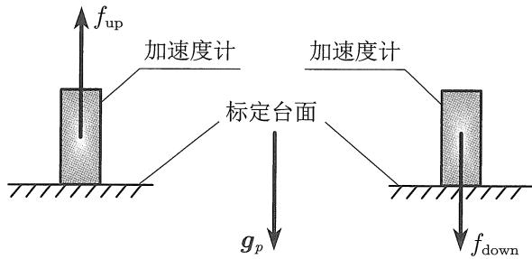
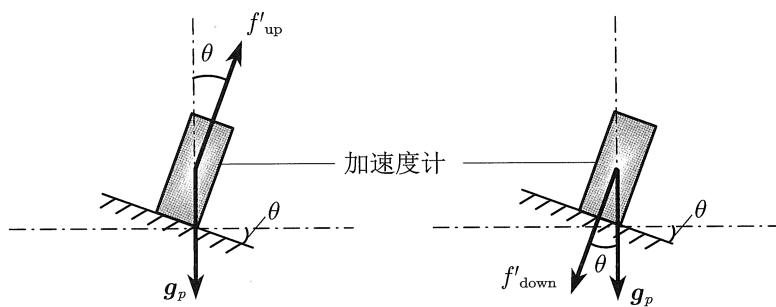
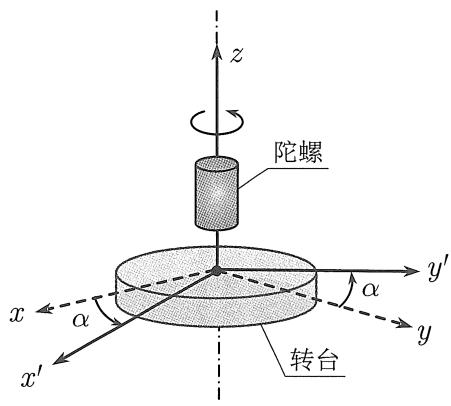
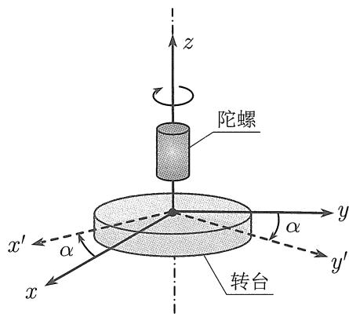
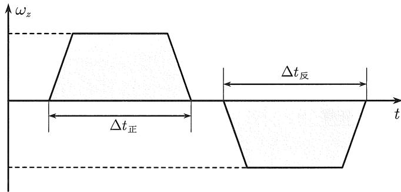

# IMU 误差标定：从两位置法到完整流程

> [!abstract] 这篇笔记的学习路线
> 先用**一根加速度计轴的两位置法**理解为什么“相加求零偏、相减求比例因子”；接着把同一想法扩展到**三轴六位置法**，解释倾角、坐标系和交轴耦合；再看**陀螺仪的正反转角位置法与静态两位置法**；最后把结果组合成 IMU 的标定与补偿流程。

本文根据原对话中的教材 4.5.2、4.5.3 和追问整理。这里采用对话中的符号约定：加速度计某轴“朝上”时，该轴静态理想比力记为 $+g$，“朝下”记为 $-g$。实际操作应先核实设备输出的轴向和符号，再将全部公式统一到同一约定。

图 4.14 加速度计两位置法标定示意图

先认识三个常见误差：

| 名称 | 直观含义 | 单轴模型中的位置 |
| --- | --- | --- |
| 零偏 $b$ | 理想输入为零时，读数仍有固定偏移 | 加法项 |
| 比例因子误差 $\delta s$ | 输入变化 $1$ 个单位，读数变化的倍数偏离 $1$ | 乘在真实输入前 |
| 随机噪声 $w$ | 每次读数会波动，静置平均也只能减弱而不能精确消除 | 随机加法项 |

因此，最简单的单轴模型是

$$
\boxed{\text{观测值}=(1+\delta s)\times\text{真实输入}+b+w.}
$$

下面所有标定方法都在回答同一个问题：**怎样制造已知且不同的真实输入，把乘法误差和加法误差分开？**

## 一、加速度计标定

### 1. 从一根轴开始：两位置法

把一根加速度计敏感轴朝上，静止一段时间并取平均；再将它朝下，仍静止一段时间并取平均。暂时忽略均值中剩余的随机噪声。因为重力在这根轴上的投影从 $+g$ 变为 $-g$，而传感器自身的零偏没有因为翻转就改变，得到

$$
\begin{aligned}
\tilde f_{\mathrm{up}}&=b_a+(1+\delta s_a)g,\\
\tilde f_{\mathrm{down}}&=b_a-(1+\delta s_a)g.
\end{aligned}
$$

把两式并排看，最重要的是分清**哪些项变号**：

| 项 | 朝上 | 朝下 | 原因 |
| --- | --- | --- | --- |
| 重力输入经过比例因子后的贡献 | $+(1+\delta s_a)g$ | $-(1+\delta s_a)g$ | 敏感轴相对重力翻转 |
| 零偏 | $+b_a$ | $+b_a$ | 是传感器本身的固定偏移 |

#### 第一步：相加求零偏

$$
\begin{aligned}
\tilde f_{\mathrm{up}}+\tilde f_{\mathrm{down}}
&=[b_a+(1+\delta s_a)g]+[b_a-(1+\delta s_a)g]\\
&=2b_a.
\end{aligned}
$$

所以

$$
\boxed{\hat b_a=\frac{\tilde f_{\mathrm{up}}+\tilde f_{\mathrm{down}}}{2}.}
$$

#### 第二步：相减求比例因子

$$
\begin{aligned}
\tilde f_{\mathrm{up}}-\tilde f_{\mathrm{down}}
&=[b_a+(1+\delta s_a)g]-[b_a-(1+\delta s_a)g]\\
&=2(1+\delta s_a)g.
\end{aligned}
$$

先除以 $2g$，得到真实的读数增益 $1+\delta s_a$；再减去理想增益 $1$：

$$
\boxed{\widehat{\delta s}_a
=\frac{\tilde f_{\mathrm{up}}-\tilde f_{\mathrm{down}}}{2g}-1.}
$$

> [!example] 带数字算一次，也纠正原对话中的口误
> 如果两次读数是 $1.01g$ 和 $-0.97g$，则
> $\hat b_a=(1.01g-0.97g)/2=0.02g$；
> $\widehat{\delta s}_a=[1.01g-(-0.97g)]/(2g)-1=0.99-1=-0.01$。
> **比例因子误差是 $-1\%$，不是 $+1\%$。**原对话把最后这个符号算错了。这也可由读数跨度 $1.98g$ 小于理想跨度 $2g$ 直观看出。

#### 为什么要在每个位置静置并取均值？

真实数据包含噪声：$\tilde f_{\mathrm{up}}=b_a+(1+\delta s_a)g+\bar w_{\mathrm{up}}$，朝下也一样。两次随机噪声一般不同，相加、相减都不能让它们精确抵消。静置多采样并求均值可以减小随机波动，也要避免翻转和停稳过程混入“静态”数据。

### 2. 你的第一个疑惑：放不正、有倾角时怎么办？

图 4.15 加速度计两位置法标定的鲁棒性示意图（考虑水平基准有偏角）

你问到实际平面不可能完全理想，是否必然存在倾角。更准确地说，**我们无法轻易保证敏感轴恰好铅垂**：误差可能来自台面水平度、夹具、IMU 外壳与内部敏感轴的安装关系。即使台面很平，也不代表它绝对水平。

先只分析**这一根轴**。若朝上与朝下偏离铅垂的角度同为 $\theta$，而且两次轴向的重力投影恰好一正一负，则输入不是 $\pm g$，而是 $\pm g\cos\theta$：

$$
\tilde f'_{\mathrm{up}}=b_a+(1+\delta s_a)g\cos\theta,\qquad
\tilde f'_{\mathrm{down}}=b_a-(1+\delta s_a)g\cos\theta.
$$

再次相加，相反的重力投影仍抵消，所以

$$
\boxed{\hat b_a=\frac{\tilde f'_{\mathrm{up}}+\tilde f'_{\mathrm{down}}}{2}=b_a.}
$$

再次相减，得到 $2(1+\delta s_a)g\cos\theta$。如果知道 $\theta$，用

$$
\boxed{\widehat{\delta s}_a
=\frac{\tilde f'_{\mathrm{up}}-\tilde f'_{\mathrm{down}}}
{2g\cos\theta}-1.}
$$

如果不知道 $\theta$，却仍按 $2g$ 作分母，算到的会是 $(1+\delta s_a)\cos\theta-1$，里面混入了姿态误差。小角度下 $1-\cos\theta\approx\theta^2/2$（$\theta$ 必须用弧度），所以单轴投影误差通常较小。教材举例称 $0.2^\circ$ 只产生 $1\,\mathrm{ppm}$；实际按 $1-\cos(0.2^\circ)$ 计算约为 **$6.1\,\mathrm{ppm}$**。

> [!important] “零偏不受倾角影响”有前提
> 上面相加抵消要求两次的**轴向投影大小相同、符号相反**。若朝上与朝下的角度分别是 $\theta_1$、$\theta_2$，则
> $$
> \hat b_a-b_a=
> \frac{(1+\delta s_a)g}{2}
> \bigl(\cos\theta_1-\cos\theta_2\bigr).
> $$
> 因此随手放置、两次姿态不对称时，零偏也会受到影响。

### 3. 为什么要从两位置扩展到六位置？

一根轴的两位置法只关注这根轴如何响应沿它自身方向的输入。但三轴加速度计还可能有**交轴耦合**：明明只给 $x$ 方向输入，$y$、$z$ 输出也随它变化。要测量这种现象，每次不能只读“朝上”的那一轴，而应读 **全部三轴**。

把 IMU 依次放成六种姿态：$x+$、$x-$、$y+$、$y-$、$z+$、$z-$。每个姿态都有三个输出，故共有 $6\times3=18$ 个标量读数。理想情况下，六个真实输入在 IMU 坐标系中分别是

$$
g\boldsymbol e_x,\ -g\boldsymbol e_x,\quad
g\boldsymbol e_y,\ -g\boldsymbol e_y,\quad
g\boldsymbol e_z,\ -g\boldsymbol e_z,
$$

其中 $\boldsymbol e_x=[1,0,0]^T$ 等是坐标轴单位向量。

### 4. 六位置的三轴测量模型

把单轴的乘法系数升级为矩阵：

$$
\boxed{
\tilde{\boldsymbol f}_i=K_a\boldsymbol f_i^b+\boldsymbol b_a
+\boldsymbol\epsilon_i
},\qquad
K_a=
\begin{bmatrix}
1+\delta s_x&m_{xy}&m_{xz}\\
m_{yx}&1+\delta s_y&m_{yz}\\
m_{zx}&m_{zy}&1+\delta s_z
\end{bmatrix}.
$$

$K_a$ 的**对角线**是三个轴的比例因子；六个**非对角元素**表示一个方向的输入出现在另一输出轴上。例如 $m_{yx}$ 表示 $x$ 方向输入对 $y$ 轴读数的影响。也可写成 $K_a=I+S_a+N_a$，其中 $I$ 是理想单位矩阵，$S_a=\operatorname{diag}(\delta s_x,\delta s_y,\delta s_z)$，$N_a$ 的对角线为零、非对角线是交轴耦合项。再加上 $\boldsymbol b_a=[b_x,b_y,b_z]^T$ 的三个分量，共有 **$9+3=12$ 个待估参数**。

请留意上下标：$\boldsymbol f_i^b$ 是第 $i$ 个姿态下、**用同一 IMU 机体坐标系 $b$ 表达**的真实三维比力。下面的推导中 $K_a$ 与 $\boldsymbol b_a$ 在六次实验中保持相同，变化的是 $\boldsymbol f_i^b$。

### 5. 只看 $x$ 上、$x$ 下，就能理解整个矩阵

令 $x$ 轴朝上时 $\boldsymbol f_{x+}^b=g\boldsymbol e_x$，则

$$
\tilde{\boldsymbol f}_{x+}
=K_a(g\boldsymbol e_x)+\boldsymbol b_a
=
\begin{bmatrix}
b_x+(1+\delta s_x)g\\
b_y+m_{yx}g\\
b_z+m_{zx}g
\end{bmatrix}.
$$

$x$ 轴朝下时，输入变为 $-g\boldsymbol e_x$：

$$
\tilde{\boldsymbol f}_{x-}
=
\begin{bmatrix}
b_x-(1+\delta s_x)g\\
b_y-m_{yx}g\\
b_z-m_{zx}g
\end{bmatrix}.
$$

这次把**向量**相加和相减：

$$
\frac{\tilde{\boldsymbol f}_{x+}+\tilde{\boldsymbol f}_{x-}}{2}
=\boldsymbol b_a,\qquad
\frac{\tilde{\boldsymbol f}_{x+}-\tilde{\boldsymbol f}_{x-}}{2g}
=K_a\boldsymbol e_x
=\begin{bmatrix}1+\delta s_x\\m_{yx}\\m_{zx}\end{bmatrix}.
$$

为什么是矩阵的**第一列**？因为用 $\boldsymbol e_x=[1,0,0]^T$ 右乘矩阵，会选出它的第一列。这一列回答的是：**给 $x$ 输入时，三个输出各自变化多少。**重复 $y$ 上／下得到第二列，$z$ 上／下得到第三列。到这里，两位置法已经自然扩展成六位置法。

### 6. 你的第二个疑惑：六次实验的坐标系如何统一？

你的理解“变化的不是单独一个角度，而是整个坐标系相对于外界的姿态”是对的。IMU 被整个翻转或旋转；我们在计算中始终使用**固定在 IMU 上的同一个 $b$ 坐标系**。可以想象把 $x,y,z$ 三支小箭头画在 IMU 外壳上：你移动 IMU，这三支箭头跟着移动，但在 IMU 自己看来，它们仍叫 $x,y,z$。重力方向在这些箭头上的三个投影随姿态变化。

例如理想的 $x+$ 姿态给出 $\boldsymbol f_{x+}^b=[g,0,0]^T$。若实际放歪，输入可能是 $[g\cos\theta,f_y,f_z]^T$，且满足 $f_y^2+f_z^2=g^2\sin^2\theta$。**只知道 $\theta$，一般还不知道倾斜朝哪个方位，因此不能仅凭 $\theta$ 算出 $f_y,f_z$。**

### 7. 你的第三个疑惑：六位置法能否只用 $\cos\theta$ 修正？

对于前面的**单轴两位置模型**，$\cos\theta$ 可以修正该轴的重力投影；但六位置法要估计的是完整的 $3\times3$ 矩阵。放歪以后，原本应为 $[g,0,0]^T$ 的输入有了 $y,z$ 分量，输出中的变化既可能来自这些真实输入，也可能来自交轴耦合。仅把 $x$ 分量改为 $g\cos\theta$，仍把 $y,z$ 当成零，会把部分姿态误差误认为标定参数。

若每个位置的实际姿态已知，就计算**完整的三维重力向量** $\boldsymbol f_i^b$ 并带入模型；若姿态未知，则应尽量准确摆放并保证成对姿态对称。进一步说，**单轴上下投影对称**足以使该单轴简化模型中的重力项抵消；要让三轴读数相加都严格得到同一个 $\boldsymbol b_a$，则需要两次完整输入向量近似互为相反数：$\boldsymbol f_{i-}^b\approx-\boldsymbol f_{i+}^b$。前述 $1-\cos\theta$ 的二阶影响只描述目标轴的投影；横向分量 $g\sin\theta$ 对小角度约为 $g\theta$，在完整三轴模型中可经交轴耦合带来一阶影响。

### 8. 教材的矩阵最小二乘式是怎么来的？

把六次三轴平均读数排成 $3\times6$ 矩阵

$$
L=
\begin{bmatrix}
\tilde{\boldsymbol f}_1&\cdots&\tilde{\boldsymbol f}_6
\end{bmatrix}.
$$

把第 $i$ 次的真实输入加上一行常数 $1$，排成 $4\times6$ 矩阵；把待求参数并排：

$$
A=
\begin{bmatrix}
\boldsymbol f_1^b&\cdots&\boldsymbol f_6^b\\
1&\cdots&1
\end{bmatrix},
\qquad
M=\begin{bmatrix}K_a&\boldsymbol b_a\end{bmatrix}.
$$

这里 $L$ 为 $3\times6$、$M$ 为 $3\times4$、$A$ 为 $4\times6$。于是六个观测式合为 $L\approx MA$。第 $i$ 列的乘法恰是 $K_a\boldsymbol f_i^b+\boldsymbol b_a$；最后一行的 $1$ 让零偏能作为待估参数进入同一个矩阵式。六列输入可依次取 $+g\boldsymbol e_x,-g\boldsymbol e_x,+g\boldsymbol e_y,-g\boldsymbol e_y,+g\boldsymbol e_z,-g\boldsymbol e_z$，但只有这些姿态确实摆准时，理想输入才能代替真实输入。

由于存在噪声，求一组 $M$ 使全部六个位置的平方残差之和 $\|L-MA\|_F^2$ 最小。令平方残差对 $M$ 的导数为零，得到正规方程 $MAA^T=LA^T$。若 $A$ 满行秩，$AA^T$ 可逆，于是

$$
\boxed{\hat M=LA^T(AA^T)^{-1}.}
$$

从 $\hat M$ 的前三列读出 $\hat K_a$，最后一列读出 $\hat{\boldsymbol b}_a$。六姿态提供 $18$ 个标量观测来估计 $12$ 个参数，所以有冗余，可利用全部数据减小随机噪声影响。但这并不能自动消除未知姿态偏差：若 $A$ 用的是错误的理想输入，求得的是混入姿态误差的参数。使用时补偿：

$$
\boxed{\hat{\boldsymbol f}
=\hat K_a^{-1}\bigl(\tilde{\boldsymbol f}-\hat{\boldsymbol b}_a\bigr).}
$$

> [!tip] 这一部分最值得记住的一句话
> 两位置法的“相加、相减”没有消失：六位置法仍对每一对相反输入这样做；矩阵形式只是把三对实验与三个输出轴一起组织起来，并在有噪声时统一求解。

## 二、陀螺仪标定

### 1. 为什么不能直接照搬加速度计的 $g$？

加速度计静止时有大小约为 $g$ 的明显已知输入。陀螺仪静止时，除零偏外主要只感受到**地球自转**；这个输入很小，用它估计比例因子不够有力。于是教材用转台提供较大的已知角度输入：正转 $+\alpha$，反转 $-\alpha$。

(a) 正转

(b) 反转

以下以 $z$ 轴陀螺为例：敏感轴朝上，与转台竖直轴对齐。地球自转在当地竖直方向的投影是

$$
\omega_{e,U}=\omega_e\sin\varphi,
$$

其中 $\varphi$ 为纬度。令 $b_g$ 为该轴零偏，$\delta s_g$ 为比例因子误差，$w_+(t),w_-(t)$ 为两段噪声，$\omega_T(t)$ 表示正转速度的正值幅度：

$$
\begin{aligned}
\tilde\omega_+(t)
&=(1+\delta s_g)[\omega_T(t)+\omega_{e,U}]+b_g+w_+(t),\\
\tilde\omega_-(t)
&=(1+\delta s_g)[-\omega_T(t)+\omega_{e,U}]+b_g+w_-(t).
\end{aligned}
$$

与加速度计类似，**转台输入变号**，但在这一安装姿态下 $b_g$ 和 $\omega_{e,U}$ 不因转台改为反转而变号。

### 2. 你的疑惑：角速度方程怎么一步步变成角度方程？

角度增量定义为角速度对时间积分。先假设正反两段采集时长都是 $\Delta t$，各自都覆盖“开始转动前—转动—完全停稳后”的完整过程，且转台净转角分别为 $+\alpha$、$-\alpha$。

对于正转，从定义出发，把每一项分别积分：

$$
\begin{aligned}
\tilde\alpha_1
&=\int_0^{\Delta t}\tilde\omega_+(t)\,dt\\
&=(1+\delta s_g)
\underbrace{\int_0^{\Delta t}\omega_T(t)\,dt}_{\alpha}
\quad +(1+\delta s_g)\omega_{e,U}
\underbrace{\int_0^{\Delta t}dt}_{\Delta t}
+b_g\underbrace{\int_0^{\Delta t}dt}_{\Delta t}
+\underbrace{\int_0^{\Delta t}w_+(t)\,dt}_{\eta_1}.
\end{aligned}
$$

这里有两个基础运算：

1. $\int\omega_T(t)\,dt=\alpha$：**角速度对时间积分就是总转角**。转台可以加速、匀速、减速，只要完整记录，积分仍给净转角。
2. $\int_0^{\Delta t}c\,dt=c\Delta t$：短时间内视为常数的零偏和地球自转角速度，积分后都乘以时长。

反转时，转台这一项积分为 $-\alpha$，其他项照旧。因此

$$
\begin{aligned}
\tilde\alpha_1
&=(1+\delta s_g)\alpha
 +(1+\delta s_g)\omega_{e,U}\Delta t
 +b_g\Delta t+\eta_1,\\
\tilde\alpha_2
&=-(1+\delta s_g)\alpha
 +(1+\delta s_g)\omega_{e,U}\Delta t
 +b_g\Delta t+\eta_2.
\end{aligned}
$$

单位也能帮助检查：$\omega_T,\omega_{e,U},b_g$ 都是角度／时间，积分后均为角度，可以与 $\alpha$ 相加。

### 3. 你的疑惑：为什么书里没有“噪声乘时间”？

严格积分后**确实应有噪声项**，即 $\eta_i=\int_0^{\Delta t}w_i(t)\,dt$。随机噪声通常每一时刻都在变，因此不能把某一瞬时的 $w_i$ 直接写成 $w_i\Delta t$。只有定义这段时间的平均噪声 $\bar w_i=\frac{1}{\Delta t}\int_0^{\Delta t}w_i(t)\,dt$ 后，才能写成 $\eta_i=\bar w_i\Delta t$。

教材在推导标定公式时省略了噪声，表达的是理想模型；实际正反两段噪声不同，$\eta_1+\eta_2$ 或 $\eta_1-\eta_2$ 不会精确为零。积分对随机波动有一定平滑作用，但零偏估计仍可能受噪声影响。

### 4. 正反转相减、相加分别求什么？

先忽略噪声。两式**相减**：

$$
\tilde\alpha_1-\tilde\alpha_2
=2(1+\delta s_g)\alpha.
$$

所以比例因子误差为

$$
\boxed{\widehat{\delta s}_g
=\frac{\tilde\alpha_1-\tilde\alpha_2}{2\alpha}-1.}
$$

两式**相加**：

$$
\frac{\tilde\alpha_1+\tilde\alpha_2}{2\Delta t}
=b_g+(1+\delta s_g)\omega_{e,U}.
$$

因此严格按最初角速度模型推导，

$$
\boxed{\hat b_g=
\frac{\tilde\alpha_1+\tilde\alpha_2}{2\Delta t}
-(1+\widehat{\delta s}_g)\omega_{e,U}.}
$$

> [!question] 你的疑惑：书中地球自转项是不是“少了 1”？
> 更准确地说，教材式 (4.40)、(4.41) 相对式 (4.38)、(4.39) 在地球自转项前省略了**整个 $(1+\delta s_g)$ 系数**，不只是数字 $1$。于是式 (4.42) 也未扣除 $\delta s_g\omega_{e,U}$。若这是有意近似，就相当于忽略一个通常很小的乘积项；它不是对前面模型严格积分的结果。教材积分式也省略了 $\eta_1,\eta_2$。

这里为何叫**角位置标定法**？因为基准是转台实际转过的角度 $\alpha$，而不是要求转台全过程始终保持极准确的固定角速率。实际转动速度仍宜接近设备的典型使用条件，并准确记录完整转动。

### 5. 为什么还要静态朝上／朝下求陀螺零偏？

转台正反转的角度输入较大，适合激励比例因子；但转动时间有限，积分噪声会影响零偏。静态朝上／朝下可以长时间平均。此时转台不转，陀螺的真实输入主要是地球自转在敏感轴上的投影：

$$
\begin{aligned}
\bar\omega_{\mathrm{up}}
&=b_g+(1+\delta s_g)\omega_{e,U},\\
\bar\omega_{\mathrm{down}}
&=b_g-(1+\delta s_g)\omega_{e,U}.
\end{aligned}
$$

相加后地球自转投影消去：

$$
\boxed{\hat b_g=
\frac{\bar\omega_{\mathrm{up}}+\bar\omega_{\mathrm{down}}}{2}.}
$$

这与加速度计两位置法的代数结构相同。但若用两式之差估计陀螺比例因子，分母只有很小的地球自转角速度，噪声和安装误差容易主导结果。教材因此建议组合：**静态两位置法标零偏，转台正反转法标比例因子**。

> [!warning] 数据截取与适用范围
> 使用上面的简化正反转公式时，两段转角大小应相同，采集时长应相同，并完整覆盖从开始前到停稳后的过程；角度和角速度单位应统一。这里推导的是**对准转台轴的一根陀螺敏感轴**的零偏与比例因子。陀螺三轴交轴耦合的严格估计需要额外的姿态、航向信息和实验设计。

## 三、把两部分合成 IMU 标定

### 1. 先说清楚“IMU 标定”包含哪些参数

IMU 同时有三轴加速度计与三轴陀螺仪。本节所谓“把两部分合成 IMU 标定”，是指**将两类传感器的分立标定结果用于同一 IMU 的读数补偿**，并非已经完成所有传感器间安装关系和系统级误差的联合估计。经过上面的实验，可以获得：

| 子系统 | 这套实验可估的参数 | 对应实验 |
| --- | --- | --- |
| 加速度计 | 三轴零偏、三轴比例因子、六个交轴耦合参数，即 $\boldsymbol b_a,K_a$ | 六位置静态标定 |
| 陀螺仪 | 各轴零偏 $\boldsymbol b_g$ | 各轴朝上／朝下的静态均值 |
| 陀螺仪 | 各轴比例因子 $\delta s_{g,x},\delta s_{g,y},\delta s_{g,z}$ | 各轴分别对准转台轴做正反转 |

这是一套从对话内容自然组合出的 IMU 标定流程。它**尚未包含陀螺完整三轴交轴耦合矩阵、加速度敏感性、温度变化等进一步误差项**；若应用精度要求更高，需要扩展模型和实验。

### 2. 按实际操作顺序走一遍

**步骤 1：约定坐标系、单位和数据格式。**在 IMU 上明确 $x,y,z$ 正方向；确认加速度计输出是比力还是已转换的加速度、陀螺输出是角速率还是每采样间隔的角增量。确定角度用度还是弧度、时间用秒，记录当地重力值 $g$ 和必要时的纬度 $\varphi$。全部姿态输入都用同一 IMU 机体坐标系表达。

**步骤 2：采六个静态位置。**依次完成 $x+$、$x-$、$y+$、$y-$、$z+$、$z-$。每次在完全停稳后采一段数据，保存三轴加速度计和三轴陀螺仪原始读数及时间戳。每个位置求稳定段均值。尽量让每对上下姿态准确相反。

**步骤 3：求加速度计参数。**把六个真实三维重力输入与六个三轴读数组织成 $A,L$，估计 $K_a,\boldsymbol b_a$。如果只想先验证原理，可用每一对的“向量相加求零偏、向量相减求对应矩阵列”手算；最终可用全部六次观测做最小二乘拟合。

**步骤 4：求陀螺零偏。**在陀螺轴分别朝上、朝下的长时间静态数据中求均值，用两均值的平均消去地球自转投影。若采用其他姿态组合，必须先核算地球自转在该轴上的投影是否确实互为相反数。

**步骤 5：求陀螺比例因子。**让待标定陀螺轴与转台轴对齐，正转 $+\alpha$、反转 $-\alpha$。两段数据分别完整积分为 $\tilde\alpha_1,\tilde\alpha_2$，代入差值公式。三轴依次完成；比例因子的准确性依赖已知转角、轴线对准和完整的数据窗口。

**步骤 6：应用补偿并回算验证。**加速度计读数用

$$
\boxed{\boldsymbol f_{\mathrm{corr}}
=\hat K_a^{-1}(\tilde{\boldsymbol f}-\hat{\boldsymbol b}_a)}
$$

修正。这里的陀螺仪模型只标定各轴零偏和比例因子，可用

$$
\boxed{\omega_{\mathrm{corr},i}
=\frac{\tilde\omega_i-\hat b_{g,i}}{1+\widehat{\delta s}_{g,i}}}
$$

逐轴修正；是否还需处理地球自转，由后续导航坐标系和运动模型决定。检查六个静态姿态补偿后的加速度模长是否接近 $g$，以及转台正反转角度回算是否接近参考转角。这是验证结果的步骤，不能用参与拟合的数据“看起来更好”就代替独立检查。

$$
\boldsymbol {f} _ {c} = \left[ \begin{array}{c c c} 1 + \delta s _ {a, x} & m _ {a, x y} & m _ {a, x z} \\ m _ {a, y x} & 1 + \delta s _ {a, y} & m _ {a, y z} \\ m _ {a, z x} & m _ {a, z y} & 1 + \delta s _ {a, z} \end{array} \right] ^ {- 1} \left(\tilde {\boldsymbol {f}} - \boldsymbol {b} _ {a}\right)\tag{4.47}
$$

$$
\boldsymbol {\omega} _ {c} = \left[ \begin{array}{c c c} 1 + \delta s _ {g, x} & m _ {g, x y} & m _ {g, x z} \\ m _ {g, y x} & 1 + \delta s _ {g, y} & m _ {g, y z} \\ m _ {g, z x} & m _ {g, z y} & 1 + \delta s _ {g, z} \end{array} \right] ^ {- 1} (\tilde {\boldsymbol {\omega}} - \boldsymbol {b} _ {g})\tag{4.48}
$$

### 3. 用一句话连起三部分

加速度计用**重力翻转**构造 $\pm g$；陀螺仪用**转台反转**构造 $\pm\alpha$，并用**静态上下翻转**提纯零偏。IMU 标定就是把这些实验所得的参数放进同一机体坐标系和补偿模型，在后续每次读取传感器时一致地使用。

> [!summary] 读完后应能自己回答
> 1. 为什么两位置法相加求零偏、相减求比例因子？
> 2. 为什么六位置法每次都要读取三轴？为什么差值给出 $K_a$ 的一列？
> 3. 何时能用 $\cos\theta$，何时必须使用完整三维重力输入？
> 4. 为什么陀螺角速度积分后，转台项变成 $\alpha$，零偏项变成 $b_g\Delta t$，噪声项变成 $\int w(t)dt$？
> 5. 为什么静态数据更适合估陀螺零偏，而已知大转角更适合估比例因子？
