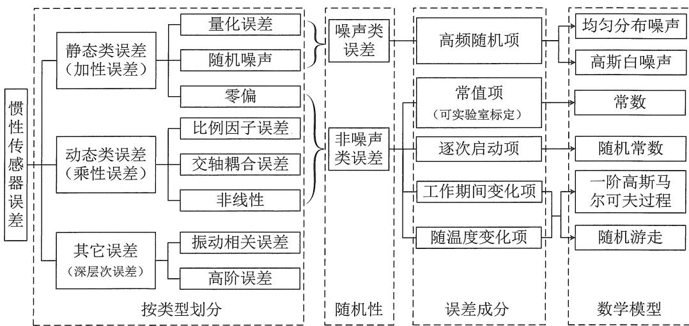
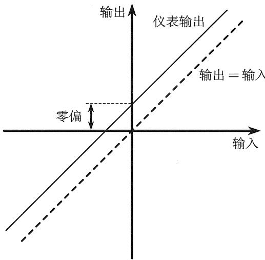
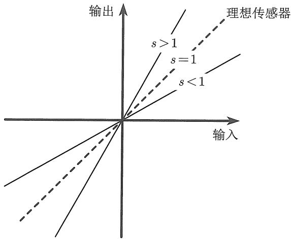
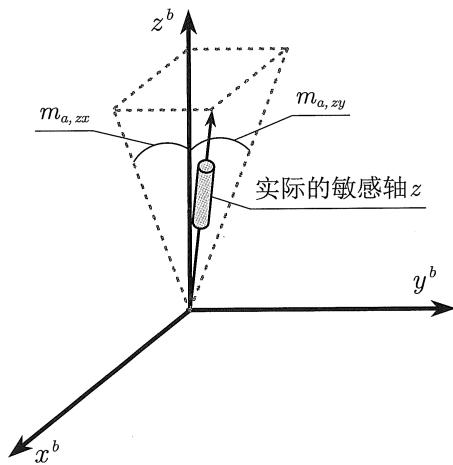
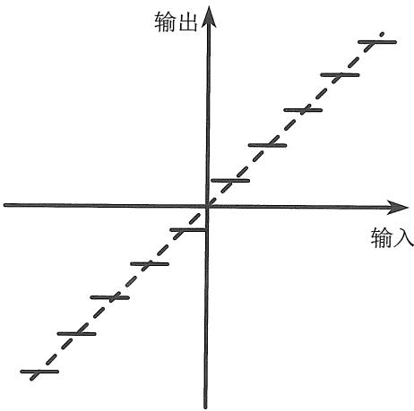

# 惯性传感器误差：从成因到补偿

> [!abstract] 先看这条主线
> **真实输入 → 传感器产生读数 → 读数混入误差 → 惯导积分放大影响 → 标定、建模与补偿。**本文以书本 **4.2 总论、4.2.1～4.2.7** 为顺序重讲。你在原对话中问到的静置比力、交轴耦合、白噪声、量化和式（4.17）～（4.18），放在对应知识点处解释。先看一维直觉，再读三轴矩阵。

这是一份学习讲义，不是书本逐段抄录。公式编号沿用原书，必要时会指出原文的单位或适用前提问题。本文用 $\tilde x$ 表示传感器报告的读数，用 $x$ 表示真实输入，用 $\hat x$ 表示估计或补偿后的量。

## 一、误差从哪里来：先弄清 IMU 的“真实输入”

### 1. IMU 本来应该测什么？

一个 IMU 通常包含三轴陀螺仪和三轴加速度计。陀螺仪的理想输入是机体相对惯性系的角速度 $\boldsymbol\omega_{ib}^{b}$；加速度计的理想输入是机体系中的**比力** $\boldsymbol f^{b}$。上标 $b$ 表示分量写在 IMU 的机体坐标系中。以后写三轴误差矩阵时，输入、输出和误差都须先放在同一坐标系。

初学时最容易误把加速度计读数当成“相对地面的加速度”。实际上，理想比力满足

$$
\boldsymbol f=\boldsymbol a_{ib}-\boldsymbol g_G,
$$

其中 $\boldsymbol a_{ib}$ 是相对惯性空间的运动加速度，$\boldsymbol g_G$ 是万有引力加速度。加速度计能感受地面的支撑等非引力作用，所以静置地面时并不读零。

> [!question] 你的前置疑惑：静止在地面的 IMU 为什么读到 $-g$？
> “静止”是相对地球静止。IMU 随地球自转，仍有向心加速度 $\boldsymbol a_c=\boldsymbol\omega_{ie}\times(\boldsymbol\omega_{ie}\times\boldsymbol r_{eb})$。当地有效重力与万有引力的**向量**关系是 $\boldsymbol g_p=\boldsymbol g_G-\boldsymbol a_c$，所以静置时 $\boldsymbol f=\boldsymbol a_c-\boldsymbol g_G=-\boldsymbol g_p$。若导航系采用 $z$ 轴向下的 NED 坐标，且 IMU 轴与它对齐，就有 $\boldsymbol f^b=[0,0,-g]^T$。这个 $-g$ 是真实比力输入，**不是加速度计零偏**。

因此，即便 IMU 静止，陀螺和加速度计也未必处于书中定义的“零输入”：高精度陀螺能测到地球自转在轴上的投影；加速度计会测到支撑力对应的比力。这一点会影响后面“静置取平均求零偏”的条件。

### 2. 用一根轴预览全部误差

先暂不考虑其他轴和数字取整，一根轴的简化读数可以写成

$$
\boxed{\tilde x=(1+s)x+b+w.}
$$

如果真实输入 $x=2$，比例因子误差 $s=1\%$、零偏 $b=0.1$，暂时无噪声，那么读数是 $2.12$。其中 $0.02$ 是随输入放大的比例因子误差，$0.1$ 是固定偏移。实际读数还可能混入其他轴的输入、随机噪声和数字量化误差。

| 环节 | 产生的误差 | 读数中的典型表现 |
| --- | --- | --- |
| 敏感元件的固有偏移、温度与上电状态 | 零偏 $b$ | 整条输入—输出曲线平移 |
| 灵敏度与理想值不一致 | 比例因子 $s$ | 直线斜率偏大或偏小 |
| 三轴实际敏感方向与名义轴不完全重合 | 交轴耦合 $m_{ij}$ | 另一轴的输入串进本轴 |
| 元件、电路、环境的快速波动 | 随机噪声 $w$ | 相同输入下读数仍会跳动 |
| 连续物理量变成有限数字刻度 | 量化误差 | 输出出现一个个数字台阶 |

### 3. 原书的两套分类，回答的是不同问题

书本 4.2 开头从两个角度分类。第一套问**误差是否依赖输入**：零偏是加性的，输入为零也可能存在；比例因子与交轴耦合是乘性的，要乘以某个真实输入才表现出来。这里的“静态/动态”是书本对**零输入/非零输入**的命名，**不等于 IMU 物理上静止/运动**。静置地面的加速度计仍有约 $1g$ 比力，因此仍可能显出比例因子误差。

第二套问**误差随时间如何变化**：高频、弱相关的波动常作为噪声处理；缓慢变化或可重复的误差常作为系统性误差标定或估计。两套分类彼此交叉。例如零偏是加性误差，却也可能随温度缓慢漂移；比例因子是乘性误差，也可能随上电状态变化。高频与低频之间没有绝对分界，要看导航系统关心的时间尺度。

| 从输入看 | 数学形态 | 从时间看可以怎样表现 |
| --- | --- | --- |
| 加性：零偏 | $b$ | 常值、温漂、逐次上电改变、工作中慢变 |
| 乘性：比例因子 | $sx$ | 可标定常值，也可能慢变 |
| 乘性：交轴耦合 | $m_{ij}x_j$ | 可标定常值，也可能慢变 |
| 快速读数波动 | $w_k$ | 常用统计噪声模型描述 |

原书还把系统性误差拆成四种**时间来源**。用零偏举例，可以帮助理解；比例因子等参数也可能有类似成分。

| 成分 | 意思 | 常见处理 |
| --- | --- | --- |
| 固有常值项 | 制造后带来的稳定偏差 | 出厂标定并存储补偿参数 |
| 随温度变化项 | 温度变了，参数也变；可重复部分可建温度模型 | 温度标定与温度补偿 |
| 逐次上电启动项 | 这次开机与下次开机的参数不同，但单次运行内较稳定 | 每次启动重新估计 |
| 上电期间变化项 | 一次运行中随时间缓慢改变 | 在线估计或漂移模型 |

> [!important] 先分清两个问题
> “**加性还是乘性**”决定误差进入测量方程的方式；“**常值、慢变还是噪声**”决定如何标定、滤波和估计。不要用一个标签代替另一个。

## 二、 零偏误差：读数为何整体偏移？

### 1. 定义与三轴表达

理想输入为零，传感器仍出现一段时间内相对稳定的输出，这部分叫**零偏**。单轴方程为 $\tilde x=x+b+w$：$b$ 是相对稳定的偏移，$w$ 是围绕它快速跳动的噪声。三轴陀螺和加速度计各有一个零偏向量，对应原书式（4.1）：

图 4.2 传感器 “输入-输出” 关系：零偏误差

$$
\boldsymbol b_g=\begin{bmatrix}b_{g,x}\\b_{g,y}\\b_{g,z}\end{bmatrix},
\qquad
\boldsymbol b_a=\begin{bmatrix}b_{a,x}\\b_{a,y}\\b_{a,z}\end{bmatrix}.
$$

陀螺零偏常用 $^\circ/\mathrm h$、$^\circ/\mathrm s$ 或 $\mathrm{rad/s}$ 表示；加速度计零偏常用 $\mathrm{m/s^2}$、$\mu g$ 等表示。$g$ 在 $\mu g$ 中是重力加速度的单位参照，不能与下标 $g$（陀螺）混淆。

> [!question] 为什么不能把静置加速度计读数直接平均，当作零偏？
> 因为静置加速度计的真实比力通常不为零。若某轴读到 $-9.80\,\mathrm{m/s^2}$，里面主要是重力所对应的真实比力，不是 $-9.80$ 的零偏。单一姿态的均值无法自动区分零偏与重力投影。可用已知姿态、正反翻转或更多位置的标定数据把两者分开。静置陀螺取平均可粗估低精度器件零偏；对高精度陀螺还须考虑约 $15^\circ/\mathrm h$ 的地球自转及其轴向投影。

### 2. 常值零偏：每次都有的固有偏移

常值零偏可理解为设备制造和装调后自带的固定偏移。出厂标定能测出并补偿大部分；低成本器件的残余可能更明显。若陀螺的恒定零偏为 $b_g$，仅看短时间单轴角度积分，它会造成近似 $\delta\theta\approx b_g t$ 的角度误差。若加速度计有恒定比力零偏 $b_a$，且忽略姿态和地球旋转等影响，速度误差近似 $\delta v\approx b_a t$，位置误差近似 $\delta p\approx\tfrac12 b_a t^2$。这说明一个小的固定偏移被积分后会变得重要；它们只是**简化的短时直觉**，不是完整惯导误差方程。

### 3. 零偏重复性：每次开机是否还是同一个值？

设同一温度、姿态等条件下，设备充分冷却后重启多次，分别得到 $b^{(1)},b^{(2)},\ldots$。这些开机后零偏的离散程度就是**逐次上电零偏重复性**。例如三次启动分别得到 $0.02$、$0.04$、$0.03^\circ/\mathrm s$，说明只记住上次的零偏未必适用于本次。它通常用多次结果的标准差表征，测量时须控制温度、姿态、预热和数据截取条件。

### 4. 零偏不稳定性：同一次开机中会不会慢慢漂？

上电稳定以后，零偏仍可能缓慢起伏。它与上一项的区别在于：**重复性比较不同次开机；单次运行零偏不稳定性比较一次开机内部随时间的变化**。书中介绍了两类统计口径：对静态数据按固定时长分段求均值，再看各段均值的离散程度；或者分析 Allan 偏差曲线的低谷及附近形态。两种试验窗口与定义不同，数值不应直接互换；Allan 曲线的指标读取还依赖具体系数约定。

### 5. 全温零偏误差：温度变了会怎样？

温度改变可让器件内部结构和电路特性变化，从而让零偏改变。**全温范围内相对参考温度的最大变化量**与**每摄氏度变化多少的温度斜率**是不同指标：前者单位仍是 $^\circ/\mathrm s$ 等零偏单位，后者还要再除以 $^\circ\mathrm C$。温漂中可重复的部分可通过多温度标定建立模型；不可重复部分只能作为剩余不确定性处理。实际工作时还需给传感器预热并记录温度。

> [!tip] 四种零偏的记忆法
> **常值**看“这台设备天生偏多少”；**重复性**看“下次开机是否还一样”；**单次运行稳定性**看“这次开机期间是否慢慢漂”；**全温误差**看“温度改变后偏多少”。同一段实际零偏可能同时包含这些成分。

## 三、比例因子误差：为什么输入越大，偏差越大？

### 1. 从斜率理解，而不是死记矩阵

图 4.3 传感器 “输入-输出” 关系：比例因子误差

理想传感器在统一输入输出单位后，输入增加 $1$，输出也应增加 $1$，斜率为 $1$。实际斜率若为 $1+s$，就有

$$
\tilde x=(1+s)x+b+w,
\qquad
\delta x_{\mathrm{SF}}=sx.
$$

零偏 $b$ 把直线整体上移或下移；比例因子误差 $s$ 改变斜率。若暂不考虑噪声，取两个已知输入 $x_1,x_2$，那么读数差中的零偏抵消：

$$
\frac{\tilde x_2-\tilde x_1}{x_2-x_1}=1+s.
$$

因此可以靠**不同已知输入**识别斜率。比如真实输入为 $2\,\mathrm{m/s^2}$、比例因子误差 $+1\%$，比例因子单独造成的读数误差是 $+0.02\,\mathrm{m/s^2}$；真实输入换成 $4$，这一项变成 $+0.04$。它是无量纲参数，可用百分比或 ppm 表示；$1\,\mathrm{ppm}=10^{-6}$。

> [!question] IMU 没运动，比例因子误差会出现吗？
> 对静置加速度计，会。它的真实比力大约为 $1g$，所以有“输入”可被比例因子放大。对静置陀螺，真实角速度还包含地球自转投影；只是在低精度器件上，该量可能远小于零偏与噪声。

### 2. 从本轴斜率到三轴对角矩阵

把三轴本轴比例因子误差放在对角线上，得到原书式（4.2）～（4.3）的简洁形式：

$$
\delta\boldsymbol f_{\mathrm{SF}}=\boldsymbol S_a\boldsymbol f,
\qquad
\boldsymbol S_a=\operatorname{diag}(s_{a,x},s_{a,y},s_{a,z}),
$$

$$
\delta\boldsymbol\omega_{\mathrm{SF}}=\boldsymbol S_g\boldsymbol\omega,
\qquad
\boldsymbol S_g=\operatorname{diag}(s_{g,x},s_{g,y},s_{g,z}).
$$

对角线表示“本轴输入改变本轴输出的倍数”。设备的比例因子也可能随温度、输入大小或上电状态变化；这个对角矩阵只是本节最常用的**线性近似**。

## 四、 交轴耦合误差：为什么别的轴会串进来？

### 1. 先看一只略微装歪的 $z$ 轴传感器

名义上，$z$ 轴加速度计只测 $f_z$。实际敏感方向若稍向 $x$ 和 $y$ 倾斜，测到的就相当于真实比力在这条斜轴上的投影：

$$
\tilde f_z\approx f_z+m_{a,zx}f_x+m_{a,zy}f_y+b_{a,z}+w_{a,z}.
$$

其中 $m_{a,zx}$ 读作“$x$ 输入进入 $z$ 输出的系数”。如果 $f_x=1g$、$m_{a,zx}=2\%$，这一项就让 $z$ 通道多出 $0.02g\approx0.196\,\mathrm{m/s^2}$。它与另一轴输入成正比，所以也属于**乘性误差**。陀螺有相同结构：只绕 $x$ 轴转动时，装偏的 $y$、$z$ 陀螺通道也可能有额外读数。

### 2. 为什么是六个参数，而不是三个？

图 4.4 交轴耦合误差示意图（以 z 轴加速度计为例）

每个输出通道都可能接收另外两个轴的输入：$x$ 输出接收 $y,z$，$y$ 输出接收 $x,z$，$z$ 输出接收 $x,y$，所以一般是 $3\times2=6$ 个。原书式（4.4）～（4.5）写作

$$
\delta\boldsymbol f_{\mathrm{cross}}=\boldsymbol N_a\boldsymbol f,
\qquad
\boldsymbol N_a=
\begin{bmatrix}
0&m_{a,xy}&m_{a,xz}\\
m_{a,yx}&0&m_{a,yz}\\
m_{a,zx}&m_{a,zy}&0
\end{bmatrix},
$$

陀螺对应 $\delta\boldsymbol\omega_{\mathrm{cross}}=\boldsymbol N_g\boldsymbol\omega$，其矩阵同形。对角线为零，因为“本轴输入造成的倍数变化”已归入比例因子矩阵 $\boldsymbol S$。

> [!question] 为什么 $m_{a,zx}$ 不必等于 $m_{a,xz}$？
> 前者是 **$x$ 输入 → $z$ 输出**，后者是 **$z$ 输入 → $x$ 输出**，涉及不同的敏感轴。只有采用额外的特殊几何约束，例如三个实际轴保持严格正交、整体只作微小刚体旋转，系数之间才可能受约束。一般三轴标定模型不预设它们相等。

> [!example] 静止时，重力也会通过交轴系数“漏”向水平方向
> 在 $z$ 向下的 NED 系，若 IMU 与导航系对齐，静置真实比力是 $[0,0,-g]^T$。若 $m_{a,xz}=0.02$，即 $z$ 输入有 $2\%$ 串入 $x$ 输出，就有 $\delta f_x=m_{a,xz}f_z=-0.02g\approx-0.196\,\mathrm{m/s^2}$。这个虚假的水平比力会影响后续速度和位置计算。这里的 $2\%$ 用来展示机制，不代表所有 IMU 都有如此大的误差。

书中交轴耦合说的是**器件内部实际敏感轴相对名义 IMU $b$ 系轴**的关系；整台 IMU 相对车辆、飞机的安装偏角又是另一层坐标关系。两者都可能让轴间出现投影，标定对象却不同。

## 五、随机噪声：同一输入，为什么读数还在跳？

### 1. 噪声从哪里来？

器件敏感结构与电路有热噪声，环境振动能扰动测量，某些陀螺内部的工作机理也会留下快速波动。即使真实输入保持不变，读数也可能是 $10.01,9.99,10.02,\ldots$。对三轴 IMU，原书式（4.6）用 $\boldsymbol w_g=[w_{g,x},w_{g,y},w_{g,z}]^T$ 和 $\boldsymbol w_a=[w_{a,x},w_{a,y},w_{a,z}]^T$ 记陀螺与加速度计的读数噪声。

这里的“随机”不是“完全无法研究”。我们不能预先算出**下一帧恰好是多少**，但可以估计它的方差、频谱、相关性等统计特征，用于滤波和误差预算。尤其要分开看：零偏是相对稳定、可估的偏移；白噪声是每帧快速变化、不能像固定零偏那样逐帧准确减掉的量。

### 2. “高斯”和“白”各是什么意思？

**高斯**描述某一时刻的数值分布，常画成钟形曲线；**白**描述不同频率上的噪声功率近似平坦。一个说“数值怎样分布”，一个说“时间上怎样相关”，不是同一个概念。工程上常同时假设“零均值、高斯、白噪声”，但真实器件只会在**关注的频段与时间尺度内**近似满足它。经过滤波的样本即使来自白噪声，也可能出现相邻相关。

功率谱密度（PSD）可以理解为“噪声功率分布在哪些频率”。理想白噪声的 PSD 在无限频率范围都一样高，只是数学模型；真实器件有有限带宽。若关心的频段内 PSD 基本平坦，就可以在这一频段使用白噪声近似；如果明显不平坦，就需考虑有色噪声或更细的模型。

### 3. 噪声密度、带宽和 RMS 怎么联系？

书中式（4.7）是

$$
\boxed{\mathrm{RMS}^2=\mathrm{PSD}\times\mathrm{BW}}.
$$

这里 $\mathrm{BW}$ 应理解为与 PSD 定义匹配的**等效噪声带宽**。记噪声密度 $N=\sqrt{\mathrm{PSD}}$，就得到 $\mathrm{RMS}=N\sqrt{\mathrm{BW}}$。例如某陀螺的角速率噪声密度为 $0.01^\circ/\mathrm s/\sqrt{\mathrm{Hz}}$，有效噪声带宽是 $100\,\mathrm{Hz}$，那么读数噪声 RMS 约为 $0.1^\circ/\mathrm s$。低通滤波缩小带宽会降低读数噪声，也会限制可跟踪的快速真实运动。

单位也可用这个式子检查：角速率 PSD 的单位是 $(^\circ/\mathrm s)^2/\mathrm{Hz}$，其平方根 $N$ 的单位是 $^\circ/\mathrm s/\sqrt{\mathrm{Hz}}$；乘上 $\sqrt{\mathrm{Hz}}$ 后，RMS 回到 $^\circ/\mathrm s$。

> [!important] 对照指标时先对齐约定
> PSD 可以采用单边或双边定义，带宽也要用相应的等效定义。只把两个设备手册中的数字拿来代入，而不核对约定，可能出现系数差异。书中的单位换算 $1^\circ/\mathrm s/\sqrt{\mathrm{Hz}}=1^\circ/\sqrt{\mathrm s}=60^\circ/\sqrt{\mathrm h}$ 是时间单位换算；是否还能直接当作某份手册的 ARW 数值，要再看它的谱约定。

### 4. 你的疑惑：ARW、VRW 是新误差吗？

不是。陀螺的角速率白噪声在姿态积分后，表现为**角度随机游走**（ARW）；加速度计的比力白噪声积分到速度，表现为**速度随机游走**（VRW）。它们是在读数层与解算结果层描述**同一噪声来源**。在采用一致单位和白噪声模型时，

$$
\sigma_\theta(T)=\mathrm{ARW}\sqrt T,
\qquad
\sigma_v(T)=\mathrm{VRW}\sqrt T.
$$

例如 $\mathrm{ARW}=0.1^\circ/\sqrt{\mathrm h}$，仅考虑这项白噪声，积分 $4\,\mathrm h$ 后的角度误差标准差是 $0.1\sqrt4=0.2^\circ$。**标准差**不是每次都恰好出现的误差，也不包括陀螺零偏。相比之下，恒定陀螺零偏的简化角度误差按 $T$ 增长；两种增长规律不同。

为什么是 $\sqrt T$？白噪声积分后，独立小段的**方差**相加，累计方差与 $T$ 成正比；标准差再对方差开方，便与 $\sqrt T$ 成正比。固定零偏每段都朝同一方向叠加，所以对应的简化误差才与 $T$ 成正比。

### 5. 为什么静态平均可以降噪，却不能求出一切误差？

如果在平均窗口内真实输入不变，且 $n$ 个样本噪声互不相关、零均值、方差同为 $\sigma_w^2$，书中式（4.8）给出

$$
\bar w=\frac1n\sum_{k=1}^{n}w_k,
\qquad
\operatorname{Var}(\bar w)=\frac{\sigma_w^2}{n},
\qquad
\boxed{\sigma_{\bar w}=\frac{\sigma_w}{\sqrt n}}.
$$

平均 $100$ 个独立样本，标准差约降为单次的 $1/10$。连续时间的式（4.9）～（4.10）说的是同一趋势：若白噪声强度为 $q_w$，对时长 $T$ 取均值，均值方差按 $q_w/T$ 缩小。平均时间变成四倍，标准差约减半。

> [!warning] 平均法的边界
> 固定零偏不会自己平均掉；温漂和慢变零偏也可能让平均时间过长反而不利。带限噪声经高频采样后，相邻样本可能相关，有效独立样本数会小于实际采样数。载体运动时，还可能把真实变化误当噪声滤掉。

## 六、 量化误差：为什么数字读数有台阶？

### 1. 普通量化：把连续数值放进有限刻度

想象一把最小刻度为 $1\,\mathrm{mm}$ 的尺：真实长度 $12.37\,\mathrm{mm}$，显示只能是某个整毫米数，两者的差就是量化误差。IMU 的模拟信号或内部累计增量最终也要编码成有限数字。设**一个计数或脉冲代表的物理量**为 $q$，其单位可能是 $^\circ/\text{脉冲}$、$\mathrm{m/s}/\text{脉冲}$ 等。

图 4.7 量化误差
每次独立四舍五入，误差通常在 $[-q/2,q/2]$；每次独立向下截断，误差在 $(-q,0]$。这些是**一次量化操作**的范围，不能直接推论多次积分后永远不累积。将量化误差当作均匀、独立的“量化噪声”，还要求信号在量化格内的位置足够分散；对很小且规律的信号，误差可能有明显相关性。

### 2. 增量输出的“多退少补”从哪里来？

书中讨论高精度 IMU 的**角增量脉冲输出**。要抓住一个特殊实现条件：本周期不足一个脉冲的余量会被内部保留，带到下周期。令真实累计角度为 $\Theta_k$，已输出的累计角度为 $Q_k$，未凑满一个脉冲的余量为 $r_k=\Theta_k-Q_k$。在单方向、向下取整的简单例子里，$0\le r_k<q$。

若每周期真实转过 $0.25''$、$q=1''/\text{脉冲}$，就会得到：

| 周期 | 真实累计角度 | 本周期脉冲 | 输出累计角度 | 暂留余量 |
| --- | ---: | ---: | ---: | ---: |
| 1 | $0.25''$ | $0$ | $0$ | $0.25''$ |
| 2 | $0.50''$ | $0$ | $0$ | $0.50''$ |
| 3 | $0.75''$ | $0$ | $0$ | $0.75''$ |
| 4 | $1.00''$ | $1$ | $1.00''$ | $0$ |

前三周期的角度没有丢掉；第四周期一起输出。**累计角度的端点误差**是 $Q_k-\Theta_k=-r_k$，其大小受一个当量 $q$ 约束。若比较单个周期的增量，误差则是

$$
(Q_k-Q_{k-1})-(\Theta_k-\Theta_{k-1})=r_{k-1}-r_k.
$$

所以单周期增量误差可以为正也可以为负，范围在约 $(-q,q)$；它**不是**每周期都在 $(-q,0]$。跨很多周期求和时，中间余量逐项抵消，只剩首尾余量之差。这才是“多退少补”使累计误差有界的原因。

> [!important] 书本 LSB 公式的量纲需要更正
> 原文先把 LSB 定义为“每个数字台阶对应的物理量”，后面又把物理单位的误差上限写成 $1/\mathrm{LSB}$。若照前一定义，设 $q=\mathrm{LSB}$，累计角度端点误差的量级应是 **$q$**，单帧换算角速率的台阶是 **$q/\Delta t$**。只有把 LSB 改定义为“每单位物理量有多少脉冲”，才会出现倒数。原文将累计角度误差范围与单周期增量误差范围写在一起，也需要按上面的余量方程分开理解。

### 3. 为什么画出的角速率会突然跳 $200^\circ/\mathrm h$？

书中的例子取 $q=1''$、采样率 $200\,\mathrm{Hz}$，所以 $\Delta t=0.005\,\mathrm s$。两个相邻角增量若差一个脉冲，换算角速率时会出现

$$
\frac{q}{\Delta t}
=\frac{1''}{0.005\,\mathrm s}
=200''/\mathrm s
=0.0556^\circ/\mathrm s
=200^\circ/\mathrm h.
$$

前表的单帧角速率显示为 $0,0,0,200''/\mathrm s$，但四帧平均是 $50''/\mathrm s$，恰好等于真实的 $0.25''/0.005\,\mathrm s$。因此，**瞬时速率图上的大台阶，不等于累计角度已经漂移了同样大的量**。加速度计若输出速度增量脉冲，也有类似现象。

> [!warning] 不能无条件说量化“可忽略”
> 累计误差有界依赖余量保留、计数正常、当量足够小等实现条件。若每帧独立取整并丢掉余量，小运动可能长期被舍弃；若有饱和、丢脉冲、额外滤波或三轴姿态积分耦合，也不能简单保证最终姿态误差始终小于一个 $q$。设计时应查设备实际输出机制。

## 七、4.2.6 其他误差：为什么基本模型还不够？

书本在这里提醒，常见的零偏、比例因子、交轴、噪声并不包办所有误差。例如陀螺可能对比力或加速度敏感，这常称为 **$g$ 敏感性**；加速度计可能有与敏感元件空间尺寸相关的效应。高频振动会激发机械结构，甚至产生共振；电路板挤压、固定螺丝应力、热变形也可能让 MEMS 输出漂移。这些机制可能需要结构设计、隔振、温度控制、额外标定或扩展误差模型。

本节的目的不是让初学者一次记住每个深层项，而是形成一个判断：**基本线性误差模型解释不了的残差，应结合设备机理和使用环境检查**。例如，只有发动机高频振动时误差突然增大，就不能只把所有异常都归为普通白噪声。

## 八、4.2.7 把所有常见误差装进一个测量模型

### 1. 从单轴相加，到三轴矩阵

书本式（4.11）～（4.16）可合并写成：

$$
\boxed{
\tilde{\boldsymbol f}^{b}
=\bigl(\boldsymbol I_3+\boldsymbol S_a+\boldsymbol N_a\bigr)
 \boldsymbol f^{b}+\boldsymbol b_a+\boldsymbol w_a,}
$$

$$
\boxed{
\tilde{\boldsymbol\omega}_{ib}^{b}
=\bigl(\boldsymbol I_3+\boldsymbol S_g+\boldsymbol N_g\bigr)
 \boldsymbol\omega_{ib}^{b}+\boldsymbol b_g+\boldsymbol w_g.}
$$

$\boldsymbol I_3$ 是理想三轴响应；$\boldsymbol S$ 的**对角线**放三个比例因子误差；$\boldsymbol N$ 的**非对角线**放六个交轴系数；$\boldsymbol b$ 加上零偏；$\boldsymbol w$ 加上随机读数噪声。$\boldsymbol N_a$ 是交轴矩阵，**不是 noise 的缩写**；噪声在这里专门记为 $\boldsymbol w_a$。

只展开 $x$ 轴，就能看到每项来自哪里：

$$
\tilde f_x
=(1+s_{a,x})f_x
+m_{a,xy}f_y+m_{a,xz}f_z
+b_{a,x}+w_{a,x}.
$$

这组基础模型没有显式写出第 4.2.5 节的量化误差。若数字当量或输出机制对目标精度有影响，应另做量化误差分析；也不能把第 4.2.6 节的振动、温度等深层影响都强行塞进白噪声项。

原书式（4.13）～（4.16）写的是**测量误差**，即从测量值中减去真实值：

$$
\delta\boldsymbol f
=\tilde{\boldsymbol f}-\boldsymbol f
=\boldsymbol b_a+(\boldsymbol S_a+\boldsymbol N_a)\boldsymbol f+\boldsymbol w_a,
$$

陀螺同理。这些式子是**同坐标系、线性化、未饱和**情况下的常用模型；高阶非线性、温度、振动等影响可能需要另加项。

### 2. “随机常数、随机游走、一阶高斯–马尔可夫”说的是参数如何变化

测量模型告诉我们误差**如何进入当前读数**；随机过程模型告诉滤波器误差参数**下一时刻可能怎样变化**。两层意思不要混在一起。

| 时间模型 | 直观图像 | 书中常见用途 |
| --- | --- | --- |
| 随机常数 | 每台设备或每次启动的值事先未知，但这段工作时间内基本不变 | 常值零偏、较稳的比例因子和交轴参数 |
| 随机游走 | 每一步叠加一点不可预测的小变化，没有明显“回到原处”的趋势 | 漂移的零偏等 |
| 一阶高斯–马尔可夫过程 | 会慢变，但有相关时间，倾向围绕某水平波动 | 短时相关的零偏或其他慢变参数 |
| 白噪声 | 快速变化，常近似为相邻时刻不相关 | 读数噪声或驱动慢变过程的噪声 |

“随机常数”不是“每帧随机抽一个新零偏”：随机性在于**事先不知道它到底是多少**。组合导航开始时给它不确定性，随着观测增加逐渐估计它。

### 3. 你的疑惑：为什么先减零偏，再乘逆矩阵？

暂时略去无法逐点预知的 $\boldsymbol w_a$，令 $\boldsymbol A_a=\boldsymbol I_3+\boldsymbol S_a+\boldsymbol N_a$。正向读数过程是

$$
\tilde{\boldsymbol f}=\boldsymbol A_a\boldsymbol f+\boldsymbol b_a.
$$

求真实输入时，先减加性项：$\tilde{\boldsymbol f}-\boldsymbol b_a=\boldsymbol A_a\boldsymbol f$；再消除乘性项：$\boldsymbol f=\boldsymbol A_a^{-1}(\tilde{\boldsymbol f}-\boldsymbol b_a)$。现实中参数只能估计，所以原书式（4.17）写为

$$
\boxed{
\hat{\boldsymbol f}
=\bigl(\boldsymbol I_3+\hat{\boldsymbol S}_a+\hat{\boldsymbol N}_a\bigr)^{-1}
 (\tilde{\boldsymbol f}-\hat{\boldsymbol b}_a).}
$$

原书式（4.18）的陀螺补偿完全同理：

$$
\boxed{
\hat{\boldsymbol\omega}_{ib}
=\bigl(\boldsymbol I_3+\hat{\boldsymbol S}_g+\hat{\boldsymbol N}_g\bigr)^{-1}
 (\tilde{\boldsymbol\omega}_{ib}-\hat{\boldsymbol b}_g).}
$$

> [!question] 尖号和波浪号是什么意思？
> **波浪号 $\tilde{\ }$** 表示传感器报出的含误差观测；**帽子 $\hat{\ }$** 表示估计值。$\hat{\boldsymbol b}_a$ 是估计出的零偏，$\hat{\boldsymbol f}$ 是用这些估计参数修正后的比力，未必等于未知真值。其他教材也可能采用不同约定，应以该教材的符号说明为准。

> [!example] 用数字看补偿顺序
> 若 $f_x=1$、$f_y=2\,\mathrm{m/s^2}$，$x$ 通道比例误差 $1\%$、$y$ 向 $x$ 串入 $2\%$、零偏 $0.1\,\mathrm{m/s^2}$，则 $\tilde f_x=1.01\times1+0.02\times2+0.1=1.15\,\mathrm{m/s^2}$。若参数和 $f_y$ 已准确获知，先减 $0.1$ 和串入的 $0.04$，再除以 $1.01$，得到 $f_x=1$。三轴互相串入时，统一用矩阵逆处理。

### 4. 为什么不能把白噪声也逐点减掉？

滤波器可以估计“噪声总体有多大”，比如方差和 PSD，却不知道此时此刻的 $w_{a,x}$ 究竟是多少。因此式（4.17）～（4.18）补偿的是**估计得到的系统性参数**，补偿后的读数仍有随机噪声、参数估计误差及未建模误差。若处理的是角增量而不是角速率，零偏还须按采样间隔换成对应的增量单位，不能把 $^\circ/\mathrm s$ 直接从 $^\circ$ 中相减。

### 5. 参数写进滤波器，就一定能估出来吗？

不一定。只看 IMU，有时分不清载体真运动、零偏与比例误差。组合导航利用 GNSS 等外部信息，把 IMU 预测与位置、速度等观测比较，才可能逐渐区分误差。长期静止或始终只朝一个方向运动时，有些比例因子或交轴系数缺乏激励，可能与其他误差混在一起。**可估性依赖运动、外部观测质量和所选模型**，不能仅凭方程里有这个参数就保证估计准确。

## 九、把第 4.2 节接回你问过的导航方程

传感器补偿之后，导航解算还要做另一件事：把比力转到导航坐标系，并处理重力和旋转坐标系效应。采用 NED 导航系时，你问过的式（3.20）可写为

$$
\dot{\boldsymbol v}_{eb}^{n}
=\boldsymbol C_b^n\hat{\boldsymbol f}^{b}
+\boldsymbol g_p^{n}
-\bigl(2\boldsymbol\omega_{ie}^{n}+\boldsymbol\omega_{en}^{n}\bigr)
 \times\boldsymbol v_{eb}^{n}.
$$

这里 $\dot{\boldsymbol v}_{eb}^{n}$ 是**相对地球速度在旋转的 $n$ 系中的分量变化率**。先用第 4.2 节模型修正 IMU 读数，再通过姿态矩阵 $\boldsymbol C_b^n$ 统一坐标系；$+\boldsymbol g_p$ 加回比力定义中减去的当地有效重力；$-2\boldsymbol\omega_{ie}\times\boldsymbol v$ 是地球自转哥氏项；$-\boldsymbol\omega_{en}\times\boldsymbol v$ 是随载体移动而转动的当地导航系修正。静置地面时 $\boldsymbol v_{eb}=0$、$\boldsymbol f^n=-\boldsymbol g_p^n$，两项抵消，速度变化率为零。

> [!important] 两种“补偿”发生在不同层面
> **第 4.2 节**修正的是 IMU 自身的零偏、比例因子、串轴等**传感器读数误差**；**速度解算式**处理的是比力、重力和旋转坐标系之间的**力学关系**。即使 IMU 完全没有传感器误差，也不能直接把加速度计比力当作相对地球的速度变化率。

## 十、对照表：看到一种异常，先怀疑什么？

| 现象 | 优先想到的误差 | 判断线索 | 常见处理 |
| --- | --- | --- | --- |
| 零输入时均值持续偏离零 | 零偏 | 与输入大小无关 | 控制输入条件后估偏、补偿 |
| 输入翻倍，本轴误差也近似翻倍 | 比例因子 | 输入—输出斜率偏离 $1$ | 多个已知输入标定 |
| $x$ 方向输入让 $z$ 通道一起变化 | 交轴耦合 | 异轴相关、系数 $m_{zx}$ | 多姿态或多方向激励标定 |
| 相同输入下读数快速跳动 | 随机噪声 | 统计方差、PSD、相关性 | 合理带宽、平均、滤波 |
| 小运动时输出成整数台阶 | 量化 | 台阶随数字当量改变 | 检查当量和余量保留机制 |
| 只在温变、振动或受力后异常 | 温漂或其他深层误差 | 与环境条件同步 | 温度模型、隔振、安装检查 |

> [!summary] 读完后，试着自己回答
> 1. 为什么“IMU 静止”不等于“加速度计输入为零”？NED 下 $f_z=-g$ 来自哪里？
> 2. 加性/乘性分类，与系统性/噪声类分类，分别回答什么问题？
> 3. 常值零偏、逐次上电重复性、单次运行不稳定性、全温零偏误差如何区分？
> 4. $s_x$ 与 $m_{zx}$ 分别乘哪个输入？为什么交轴矩阵一般有六个非对角参数？
> 5. ARW 和 VRW 与原始白噪声是什么关系？平均 $100$ 个独立样本后标准差下降多少？
> 6. $1''$ 当量在 $200\,\mathrm{Hz}$ 下为何变成 $200^\circ/\mathrm h$ 的速率台阶？什么条件下累计角度误差仍可受一个当量约束？
> 7. 式（4.17）为什么先减零偏再乘逆矩阵？为何补偿后仍有噪声？

## 来源与核对

- 主线与公式编号：教材第 4 章 4.2 节“惯性传感器误差”，并结合学习过程中的疑问整理。本讲义重写了讲解顺序，并对原文 LSB 单位和量化余量的适用条件作了明确区分。
- [Analog Devices：加速度计的 $0g$ 偏置与正反姿态](https://wiki.analog.com/resources/technical-guides/best_engineering_practices_when_using_adxl_accelerometers)；[VectorNav：陀螺与地球自转](https://www.vectornav.com/resources/inertial-navigation-primer/theory-of-operation/theory-gyros)。
- [Analog Devices：角速率噪声密度与 ARW](https://www.analog.com/en/resources/technical-articles/low-noise-feedback-control-mems-gyroscopes.html)；[MathWorks：用 Allan 方差分析惯性传感器噪声](https://www.mathworks.com/help/nav/ug/inertial-sensor-noise-analysis-using-allan-variance.html)；[Texas Instruments：量化噪声模型的适用条件](https://www.ti.com/lit/an/snoa232/snoa232.pdf)。
